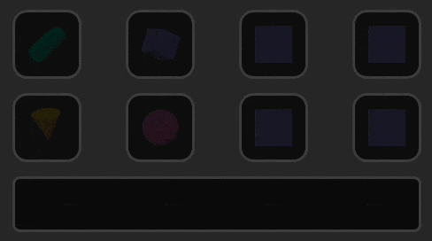

# 3D Shape Editor — Coordinator Sample

A Stream Deck plugin built with `@fcannizzaro/streamdeck-react` that demonstrates the **Action Coordinator** — a real-time cross-action communication system using shared channels.

Press a key to activate its 3D editor, then use the dials to manipulate the shape's geometry and orientation. Each key is an independent editor with its own persisted state.



## Features

| Feature                  | Description                                                                                      |
| ------------------------ | ------------------------------------------------------------------------------------------------ |
| **3D SVG Rendering**     | True 3D pipeline — rotation matrices, backface culling, Lambertian lighting, painter's algorithm |
| **5 Shape Types**        | Box, Sphere, Cone, Cylinder, Torus — each with full mesh geometry                                |
| **Dual Dial Mode**       | Press dials 1-3 to toggle between **dimension** (W/H/D) and **rotation** (X/Y/Z) control         |
| **Per-Key Independence** | Each key stores its own shape, dimensions, and rotation — scoped by action ID                    |
| **Settings Persistence** | All parameters saved via `useSettings` — survives plugin restarts                                |
| **Coordinator Channels** | Keys and dials communicate in real-time through `useChannel`                                     |

## Actions

### 3D Editor (Key)

A toggle key that activates/deactivates the 3D shape editor.

- **Press** → activate this key (dials now control its shape). Press again to deactivate.
- **Active state** → full-brightness 3D shape render on a dark background.
- **Inactive state** → dimmed shape preview showing its current configuration.

Each key instance is fully independent — place multiple keys on the deck and each maintains its own shape, dimensions, and rotation.

### Shape Dial (Encoder)

Four encoder dials that control the active key's 3D shape:

| Column | Function          | Interaction                                             |
| ------ | ----------------- | ------------------------------------------------------- |
| **0**  | Shape selector    | Rotate to cycle: Box → Sphere → Cone → Cylinder → Torus |
| **1**  | Width / Rotate X  | Rotate to adjust, **press to toggle mode**              |
| **2**  | Height / Rotate Y | Rotate to adjust, **press to toggle mode**              |
| **3**  | Depth / Rotate Z  | Rotate to adjust, **press to toggle mode**              |

When no key is active, all dials show a blank state.

**Dimension mode** (default): controls width (10–100), height (10–100), and depth (10–100) with clamping.

**Rotation mode** (toggle by pressing any dial): controls rotation around X, Y, Z axes (0°–355°) with wrapping.

## 3D Rendering Pipeline

The shapes are rendered as SVG `<polygon>` elements through a real 3D pipeline:

```
Define mesh (vertices + faces)
        ↓
Apply rotation matrices (Rx → Ry → Rz)
        ↓
Orthographic projection (x, y, z) → (x, y)
        ↓
Backface culling (discard rear-facing polygons)
        ↓
Lambertian lighting (shade by angle to light source)
        ↓
Painter's algorithm (depth-sort, draw far faces first)
        ↓
SVG <polygon> elements → Takumi ImageNode
```

Each shape type has its own mesh generator:

| Shape        | Geometry                                                |
| ------------ | ------------------------------------------------------- |
| **Box**      | 8 vertices, 6 quad faces                                |
| **Sphere**   | UV mesh — 10 longitude × 7 latitude segments (70 faces) |
| **Cone**     | 14 side triangles + 1 base cap polygon                  |
| **Cylinder** | 14 side quads + 2 elliptical cap polygons               |
| **Torus**    | 14 ring segments × 8 tube segments (112 quad faces)     |

## Architecture

```
plugin.ts
  └─ createPlugin({ coordinator: true })
       ├─ toggleAction  (key)     → selector.tsx
       └─ shapeDialAction (dial)  → control-dial.tsx

Shared state via coordinator channels:
  "activeId"          → which key is being edited (or null)
  "dialMode"          → "dimension" | "rotation"
  "{keyId}:shape"     → ShapeName
  "{keyId}:width"     → number (10–100)
  "{keyId}:height"    → number (10–100)
  "{keyId}:depth"     → number (10–100)
  "{keyId}:rotateX"   → number (0–355)
  "{keyId}:rotateY"   → number (0–355)
  "{keyId}:rotateZ"   → number (0–355)
```

### Persistence Flow

```
Plugin start → useSettings loads saved values
                    ↓
            Seed coordinator channels (useEffect on mount)
                    ↓
            Dials modify channels in real-time
                    ↓
            Key observes changes → writes back to useSettings
                    ↓
            SDK persists to disk (survives restart)
```

## Project Structure

```
src/
├── plugin.ts                  Entry point — createPlugin with coordinator enabled
├── params.ts                  Shape configs, dimension/rotation constants, EditorSettings type
├── shapes.tsx                 3D mesh generators + rendering pipeline
└── actions/
    ├── selector.tsx           Toggle key — 3D shape preview + settings persistence
    └── control-dial.tsx       Encoder dials — shape/dimension/rotation controls
```

## Running

```bash
bun run dev       # Watch mode (rebuilds on changes)
bun run build     # Production build
bun run link      # Link to Stream Deck software
```
